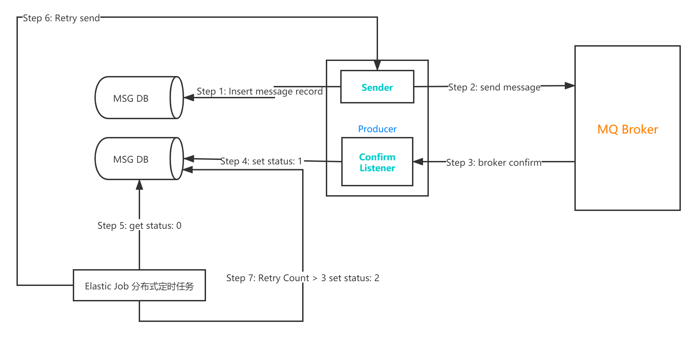

# Rabbit 可靠性投递基础组件工程
Rabbit Parent 是消息可靠性投递封装的基础组件，支持迅速消息、确认消息、可靠性消息的投递。  
基于Spring Boot、Elastic Job开发，以Jar包的形式提供调用方使用。  

   

# Module introduction  
```shell script
├─es-job                  # 独立模块 Elastic Job 手动集成作业手动配置演示工程
├─rabbit-api              # API模块 对外提供可靠性投递API
├─rabbit-common           # common模块
├─rabbit-core-producer    # core模块  可靠性消息投递核心模块
├─rabbit-demo             # core-demo模块 可靠性消息投递演示模块  
├─rabbit-task             # task模块 Elastic Job 自动装配注解配置作业封装模块
├─rabbit-task-example     # task-demo模块 Elastic Job 自动装配注解配置演示模块
└─scripts

```

# Features  
+ 可靠性  
+ 自动装配  
+ 异步投递  
+ 补偿机制  

# Getting started  
+ Add rabbit-core-producer dependency  
    + Maven:  
     ```xml
      <dependency>
          <groupId>com.itihub.base.rabbit</groupId>
          <artifactId>rabbit-core-producer</artifactId>
          <version>1.0-SNAPSHOT</version>
      </dependency>
     ```

